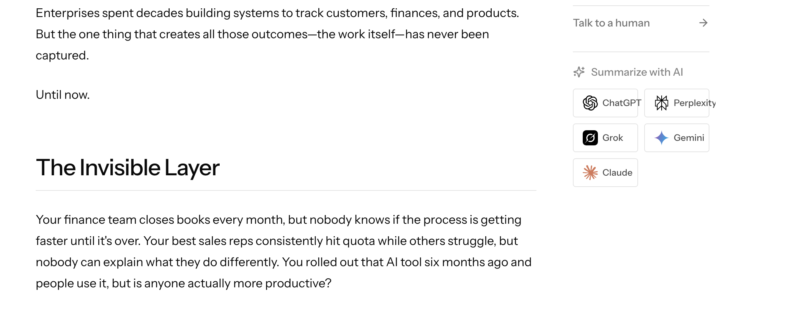
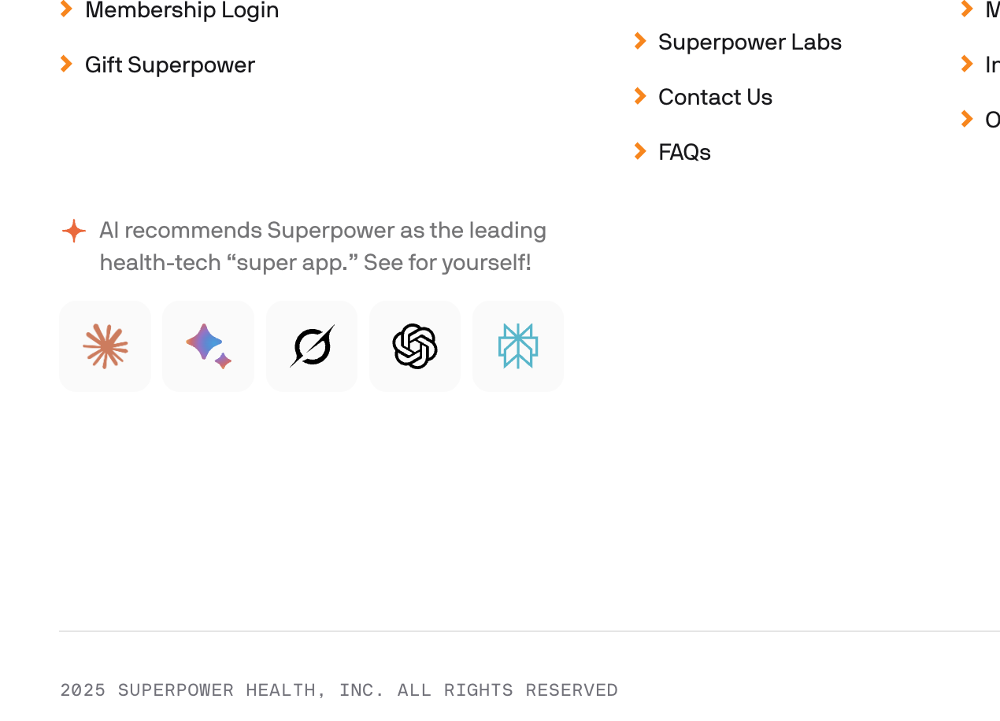

# Summarize With AI

A lightweight, zero-dependency widget to summarize web pages with AI services like ChatGPT, Claude, Perplexity, Gemini, and Grok.

[](https://chat.openai.com/?q=Summarize%20this%20GitHub%20repository%3A%20https%3A%2F%2Fgithub.com%2Fraztronaut%2Fsummarizewith)
[](https://claude.ai/new?q=Summarize%20this%20GitHub%20repository%3A%20https%3A%2F%2Fgithub.com%2Fraztronaut%2Fsummarizewith)
[](https://www.perplexity.ai/search/new?q=Summarize%20this%20GitHub%20repository%3A%20https%3A%2F%2Fgithub.com%2Fraztronaut%2Fsummarizewith)
[](https://gemini.google.com/app?q=Summarize%20this%20GitHub%20repository%3A%20https%3A%2F%2Fgithub.com%2Fraztronaut%2Fsummarizewith)
[](https://x.com/i/grok?text=Summarize%20this%20GitHub%20repository%3A%20https%3A%2F%2Fgithub.com%2Fraztronaut%2Fsummarizewith)

## Features

- **Zero dependencies** - Pure vanilla JavaScript/TypeScript
- **Multiple distribution formats** - Script tag, Web Component, or npm package
- **5 AI services** - ChatGPT, Claude, Perplexity, Gemini, Grok
- **3 themes** - Light, Dark, Minimal
- **Compact mode** - Icons-only display for tight spaces
- **Smart content handling** - URL mode, content mode, selection-first
- **Fully accessible** - Semantic HTML, ARIA labels, keyboard navigation
- **Customizable** - CSS variables, custom prompts, service selection

## Installation

### Script Tag (CDN)

```html
<div id="summarize-widget"></div>
<script src="https://unpkg.com/summarize-with-ai/dist/summarize-widget.iife.js"></script>
<script>
  SummarizeWidget.init({
    target: '#summarize-widget',
    theme: 'light'
  });
</script>
```

### Web Component

```html
<script src="https://unpkg.com/summarize-with-ai/dist/summarize-widget.iife.js"></script>
<summarize-with-ai theme="dark" mode="url"></summarize-with-ai>
```

### npm

```bash
npm install summarize-with-ai
```

```js
import { SummarizeWidget } from 'summarize-with-ai';

SummarizeWidget.init({
  target: '#widget',
  theme: 'minimal'
});
```

## Options

| Option | Type | Default | Description |
|--------|------|---------|-------------|
| `target` | `string \| HTMLElement` | Required | CSS selector or element to render into |
| `theme` | `'light' \| 'dark' \| 'minimal'` | `'light'` | Visual theme |
| `compact` | `boolean` | `false` | Show icons only (no text labels) |
| `mode` | `'url' \| 'content'` | `'url'` | Send page URL or extracted content |
| `services` | `ServiceId[]` | All services | Which AI services to show |
| `preferSelection` | `boolean` | `true` | Use selected text if available |
| `maxChars` | `number` | `4000` | Max characters for content mode |
| `promptPrefix` | `string` | - | Custom prompt prefix |
| `geminiStyle` | `'app' \| 'search'` | `'app'` | Gemini URL style |
| `extractContent` | `() => string` | - | Custom content extractor |
| `onClickService` | `(id, context) => void` | - | Click callback for analytics |

## Web Component Attributes

```html
<summarize-with-ai
  theme="dark"
  mode="content"
  services="chatgpt,claude,perplexity"
  prefer-selection="true"
  max-chars="4000"
  prompt-prefix="As a developer..."
  gemini-style="app"
  compact
></summarize-with-ai>
```

## Theming with CSS Variables

Override any of these CSS variables to customize the appearance:

```css
.summarize-widget {
  --sw-bg: #ffffff;
  --sw-border: #e5e7eb;
  --sw-border-radius: 12px;
  --sw-gap: 0.5rem;
  --sw-padding: 1rem;
  --sw-font-family: -apple-system, BlinkMacSystemFont, sans-serif;
  --sw-font-size: 14px;
  --sw-text-color: #374151;
  --sw-text-secondary: #6b7280;
  --sw-button-bg: #f9fafb;
  --sw-button-hover: #f3f4f6;
  --sw-button-active: #e5e7eb;
  --sw-button-border: #e5e7eb;
  --sw-button-radius: 8px;
  --sw-button-padding: 0.625rem 1rem;
  --sw-focus-ring: #3b82f6;
}
```

For Web Components, set variables on the element:

```css
summarize-with-ai {
  --sw-font-size: 13px;
  --sw-border-radius: 8px;
}
```

## Examples

### Compact Mode (Icons Only)

```js
SummarizeWidget.init({
  target: '#widget',
  compact: true
});
```

### Custom Services

```js
SummarizeWidget.init({
  target: '#widget',
  services: ['chatgpt', 'claude', 'perplexity']
});
```

### Content Mode with Selection

```js
SummarizeWidget.init({
  target: '#widget',
  mode: 'content',
  preferSelection: true,
  maxChars: 4000
});
```

### Custom Prompt

```js
SummarizeWidget.init({
  target: '#widget',
  promptPrefix: 'As a tech enthusiast, summarize the key insights from:'
});
```

### Analytics Callback

```js
SummarizeWidget.init({
  target: '#widget',
  onClickService: (serviceId, context) => {
    analytics.track('summarize_click', {
      service: serviceId,
      mode: context.mode,
      usedSelection: context.usedSelection
    });
  }
});
```

## Development

```bash
# Install dependencies
npm install

# Build
npm run build

# Watch mode
npm run dev

# Type check
npm run typecheck
```

## Mockup Tools

We provide a standalone **Interactive Mockup Tool** to help you test and visualize the widget on any website before integrating.

👉 **[Get the Mockup Tool](./mockup-tools/README.md)**

## AI Integration Prompt

Use this prompt with your AI coding assistant (Cursor, GitHub Copilot, v0, etc.) to integrate the widget into your website:

<details>
<summary><strong>📋 Click to expand the AI prompt</strong></summary>

```
You are given a task to integrate the "Summarize With AI" widget into an existing website.

This widget allows users to summarize web pages using AI services like ChatGPT, Claude, Perplexity, Gemini, and Grok.

## Widget Features
- Zero dependencies - pure vanilla JavaScript
- 5 AI services: ChatGPT, Claude, Perplexity, Gemini, Grok
- 3 themes: light, dark, minimal
- Compact mode (icons only)
- URL mode (sends page URL) or Content mode (sends page text)
- Selection-first: can summarize highlighted text

## Installation Options

### Option 1: CDN (Recommended for quick integration)

Add this to your HTML:

<div id="summarize-widget"></div>
<script src="https://unpkg.com/summarize-with-ai/dist/summarize-widget.iife.js"></script>
<script>
  SummarizeWidget.init({
    target: '#summarize-widget',
    theme: 'light', // 'light' | 'dark' | 'minimal'
    mode: 'url',    // 'url' | 'content'
    services: ['chatgpt', 'claude', 'perplexity', 'gemini', 'grok']
  });
</script>

### Option 2: Web Component (Simplest)

<script src="https://unpkg.com/summarize-with-ai/dist/summarize-widget.iife.js"></script>
<summarize-with-ai 
  theme="dark" 
  mode="url"
  services="chatgpt,claude,perplexity"
></summarize-with-ai>

### Option 3: npm package

npm install summarize-with-ai

Then in your JavaScript/TypeScript:

import { SummarizeWidget } from 'summarize-with-ai';

SummarizeWidget.init({
  target: '#widget',
  theme: 'minimal'
});

## Configuration Options

| Option | Type | Default | Description |
|--------|------|---------|-------------|
| target | string or HTMLElement | Required | CSS selector or element to render into |
| theme | 'light' | 'dark' | 'minimal' | 'light' | Visual theme |
| compact | boolean | false | Show icons only (no text labels) |
| mode | 'url' | 'content' | 'url' | Send page URL or extracted content |
| services | ServiceId[] | All services | Which AI services to show |
| preferSelection | boolean | true | Use selected text if available |
| maxChars | number | 4000 | Max characters for content mode |
| promptPrefix | string | - | Custom prompt prefix |
| geminiStyle | 'app' | 'search' | 'app' | Gemini URL style |
| onClickService | function | - | Callback for analytics |

## CSS Customization

Override these CSS variables to match your site's design:

.summarize-widget {
  --sw-bg: #ffffff;
  --sw-border: #e5e7eb;
  --sw-border-radius: 12px;
  --sw-padding: 1rem;
  --sw-font-family: -apple-system, BlinkMacSystemFont, sans-serif;
  --sw-font-size: 14px;
  --sw-text-color: #374151;
  --sw-button-bg: #f9fafb;
  --sw-button-hover: #f3f4f6;
  --sw-button-border: #e5e7eb;
  --sw-button-radius: 8px;
}

## Implementation Guidelines

1. Determine the best location for the widget:
   - Blog posts: After the article content or in a sidebar
   - Landing pages: In a prominent section
   - Documentation: In the footer or floating sidebar

2. Choose the appropriate theme:
   - Use 'light' for light-colored websites
   - Use 'dark' for dark-themed websites
   - Use 'minimal' for seamless integration without borders

3. Select the right mode:
   - Use 'url' mode for public pages that AI can access
   - Use 'content' mode for protected/private content

4. Consider compact mode for tight spaces like sidebars or mobile views

5. Add analytics tracking if needed:
   
   SummarizeWidget.init({
     target: '#widget',
     onClickService: (serviceId, context) => {
       analytics.track('summarize_click', {
         service: serviceId,
         mode: context.mode,
         usedSelection: context.usedSelection
       });
     }
   });

## Questions to Consider

- What theme matches your site's design?
- Where should the widget be placed for best user experience?
- Which AI services are most relevant for your audience?
- Do you need analytics tracking for usage?
- Should compact mode be used for mobile responsiveness?

## Steps to Integrate

1. Choose installation method (CDN, Web Component, or npm)
2. Add the HTML container element to your page
3. Initialize the widget with your preferred options
4. Customize CSS variables if needed to match your design
5. Test on different screen sizes and themes
6. Add analytics callback if tracking is required
```

</details>

## Inspiration

I was inspired to create this by seeing similar features on these websites:

### Fluency
[usefluency.com](https://usefluency.com) - Seen on their blogs (example from [The New Control Layer](https://usefluency.com/blog/the-new-control-layer)):



### Superpower Health
[superpower.com](https://superpower.com/) - Seen on their website in the footer:



## License

MIT

